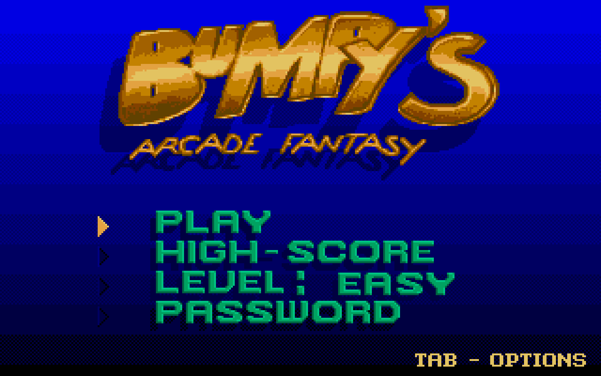
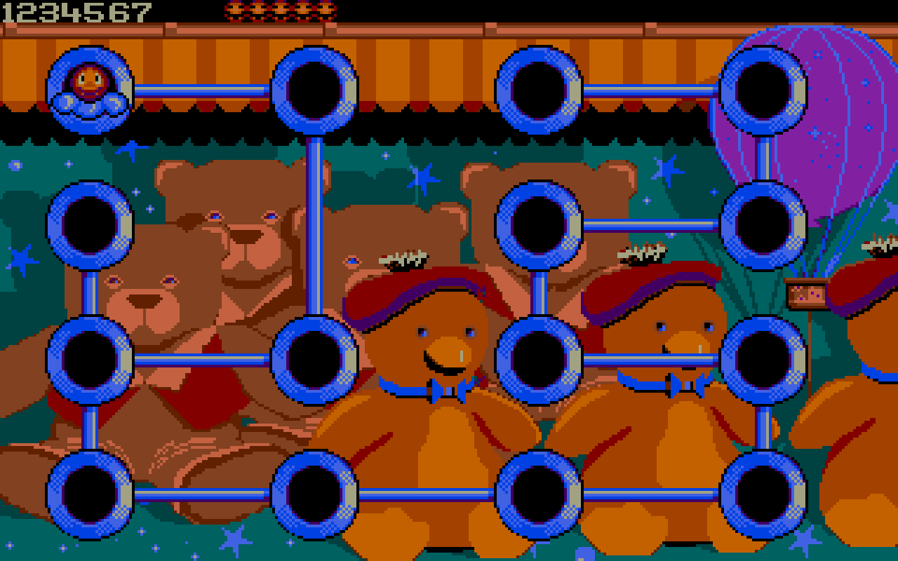
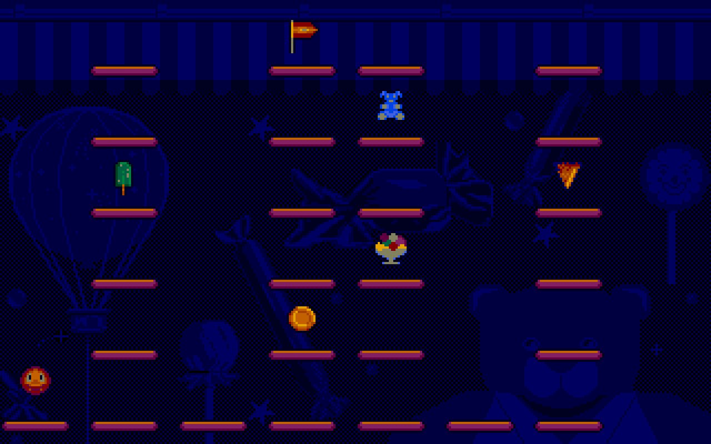
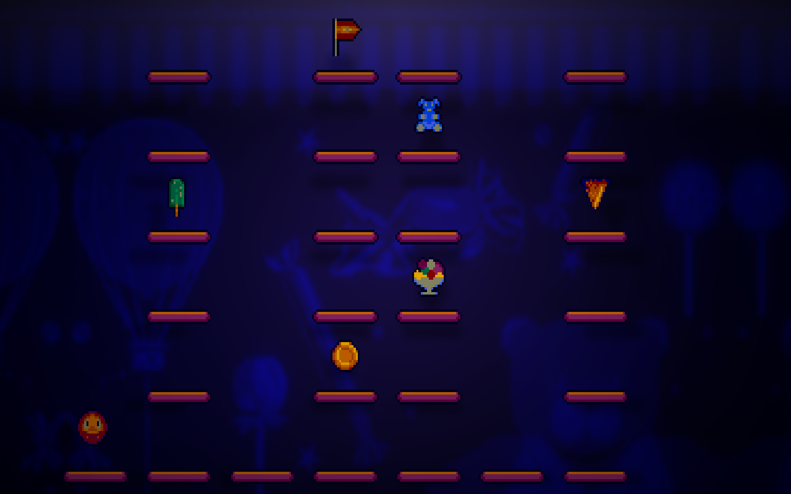

# Bumpy3D

**A vibecoded source port of *Bumpy's Arcade Fantasy* (Loriciel, 1993, DOS)** — a
native Windows 11 rebuild in C++20 / SDL3 that reads the original game's own
resource files directly. No re-implemented art, no upscaled or AI-generated
replacements: every sprite, board, and sound you see comes straight out of the
original `.EXE` and data files, decoded by a reimplementation of the original
game's own logic. The name refers to the optional [3D diorama render
mode](#3d-render-mode) below, not to upscaled assets — the sprites and boards
are the original 1993 art, unchanged.

"Vibecoded" is meant literally, not as a disclaimer: there was no source code,
no leaked build, no prior disassembly to start from. Everything here — the
`BUMPY.EXE` disassembly, every recovered file format, the physics and timing,
the audio synthesis — was reverse-engineered from the binary by working
alongside an AI coding agent (Claude Code), byte-exact-verified against the
original as it went. On top of that faithful reconstruction, the port adds a
couple of things the 1993 original never had — see [3D render mode](#3d-render-mode) below.

## Status

This is an early, preview-quality build. All 9 worlds are playable and the
core systems (physics, collision, scoring, sound) are byte/behavior-verified
against the original piece by piece — but the game is large and intricate,
and it has **not** been played through start to finish end-to-end. There will
be bugs, possibly game-breaking ones on some boards. If you hit one, please
[open an issue](https://github.com/wildpacman/bumpy_port/issues) with the
world/board and what happened.

<p align="center">
  
  
</p>
<p align="center">
  
  
</p>
<p align="center"><sub>Same board, flat (left) and in the 3D diorama render mode (right).</sub></p>

## Download & play

Grab the latest build from **[Releases](https://github.com/wildpacman/bumpy_port/releases/latest)**
— it's just the port's own `Bumpy3D.exe` + `SDL3.dll` + shaders, nothing
else. It does **not** include the original game (see [Legal](#legal) below):

1. Download and unzip the release.
2. Get your own legal copy of *Bumpy's Arcade Fantasy* and drop its files
   (`BUMPY.EXE`, `TITRE.VEC`, `MONDE1..9.VEC`, `D1..9.PAV/DEC/BUM`,
   `BUMSPJEU.BIN`, `DDFNT2.CAR`, `BUMPY.MID`, `BUMPY.BNK`, `SCORE.VEC`,
   `DESSFIN.VEC`, `FLECHE.BIN`, `MASKBUMP.VEC`, `BUMPRESE.VEC`) next to
   `Bumpy3D.exe`.
3. Run `Bumpy3D.exe`.

## Features

- All 9 original worlds, fully playable, reading the original board/sprite/
  music formats natively.
- Faithful physics, collision, scoring, and the original's PC-speaker-style
  sound effects and OPL music, timed and synthesized to match.
- An optional **3D diorama render mode** (`Alt+3`) — a real-depth, lit
  presentation of the same original sprites and board art, not in the 1993
  original.
- A `Tab` in-game settings overlay, fullscreen/aspect toggles, and a
  `bumpy_port.cfg` that remembers your preferences.

## Build from source

Requirements:
- The original game's resource files at the repo root (see step 2 above) —
  not included in this repository (see `.gitignore`); treated as read-only
  inputs the port never writes to.
- CMake >= 3.25, a C++20 compiler (MSVC / Visual Studio on Windows).
  Dependencies (SDL3, Catch2, ymfm) are fetched automatically via CMake
  `FetchContent` — nothing to install by hand.
- A GPU with OpenGL 3.3 core support for the 3D render mode (optional — the
  port falls back automatically without it).

```powershell
cmake --preset windows-debug               # One-time configure (required on fresh clone)
cmake --build --preset windows-debug      # Debug config, console kept for dev CLI flags
cmake --build --preset windows-release    # Release config, windowed (no console)
& build/windows-debug/Debug/bumpy_port.exe
& build/windows-debug/Release/bumpy_port.exe
ctest --preset windows-debug              # run the test suite
```

Both presets configure from the same `windows-debug` CMake preset and only
differ in build configuration, so both exes land under
`build/windows-debug/{Debug,Release}/`. `shaders3d/` (the 3D render mode's
GLSL sources) is copied next to the exe by the build automatically.

`tools/package_release.ps1` builds a clean redistributable zip (the port's own
files only) into `dist/` — what the GitHub Releases build is made from (it
renames the exe to `Bumpy3D.exe` for that package; the build output itself is
still `bumpy_port.exe`, matching the CMake project name).

## Controls

| Key | Action |
|---|---|
| Arrows | Move / navigate menus and the world map |
| Enter / Space | Confirm / fire |
| Escape | Context-sensitive: quits from the menu, drops a life and returns to the world map from a level, GAME OVER from the map (matches the original's two-step exit) |
| Tab | Settings overlay (video/audio) |
| Alt+Enter | Toggle fullscreen |
| Alt+A | Toggle display aspect of the flat (2D) presentation: 4:3 CRT-style (default) / 16:10 square pixels — the 3D mode is always 4:3-corrected |
| Alt+3 | Toggle the **3D diorama render mode** (in-level only; see below), on by default |
| Alt+R | *(Debug builds only)* Hot-reload the 3D diorama's shaders from `shaders3d/` without restarting — a broken shader edit keeps the previous working programs instead of crashing |

Alt+Enter, Alt+A, and Alt+3 all persist their setting to `bumpy_port.cfg` and
are restored on the next launch (also editable from the `Tab` overlay).

## 3D render mode

An optional OpenGL 3.3 "diorama" presentation of the in-level playfield: the same
original sprites and board art, arranged with real depth, plus a soft
spotlight/vignette/shadow pass — no upscaled or new art. The stage always
presents 4:3-corrected (the CRT look the art targeted; Alt+A does not apply
inside 3D) and fills the window at any shape: wider than 4:3 reveals more of the
blurred back wall left and right (a mirrored continuation of the board mural),
narrower reveals it above and below — the playfield itself stays whole, centred,
and identically proportioned everywhere. It only dresses the in-level playfield;
the menu, world map, and other screens still render flat even with 3D on. Toggle
it with **Alt+3**, or start already in 3D with **`--render3d`** on the command
line. See `docs/PROJECT_STATUS.md` ("3D render mode") for the full design and
recovery notes.

## Configuration file

`bumpy_port.cfg` is a plain `key=value` text file the port writes next to its own
exe. It is the port's **only** on-disk persistence (high scores stay session-only,
matching the original — there is no save file). It currently holds:

```
render3d=1        # Alt+3 (on by default)
square_pixels=0   # Alt+A (1 = 16:10, 0 = 4:3, default)
fullscreen=1      # Alt+Enter (on by default)
```

Safe to hand-edit or delete; unknown keys are ignored and bad values fall back to
defaults, so files from older or newer builds are always tolerated.

## The reverse-engineering story

This started with only the original binary and data files — no source, no
docs beyond what's on the files themselves. The process: unpack the LZEXE-
compressed `BUMPY.EXE`, disassemble it (Ghidra, ~500 recovered functions),
and from there reconstruct every resource format (the `.VEC` container and its
two RLE variants, board/sprite/font formats, the OPL instrument bank, the PC
speaker SFX engine) and the entire in-level game loop — physics, collision,
scripted keyframe animations, enemy AI — byte- and behavior-verified against
the original as each piece landed. `docs/PROJECT_STATUS.md` is the full,
stage-by-stage account of that process; `analysis/` holds the recovered format
specs, the Ghidra function catalog, and the reproducible unpack pipeline.

## Legal

This repository contains only the port's own code — never the original game.
*Bumpy's Arcade Fantasy* is © 1993 Loriciel; you need your own legal copy of
it to play. The port's code is MIT-licensed (see `LICENSE`); that license does
not extend to the original game.

The port never writes to the original game's files — they're read-only inputs.
